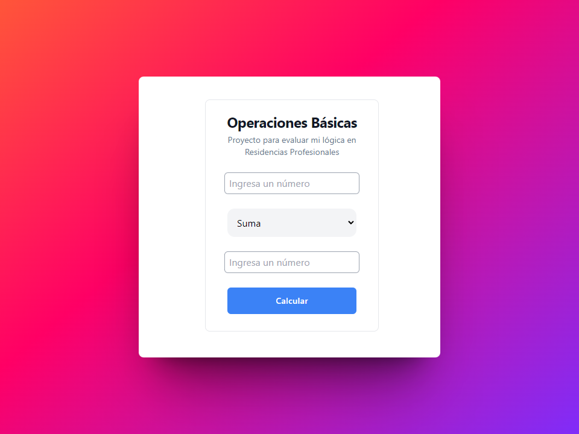
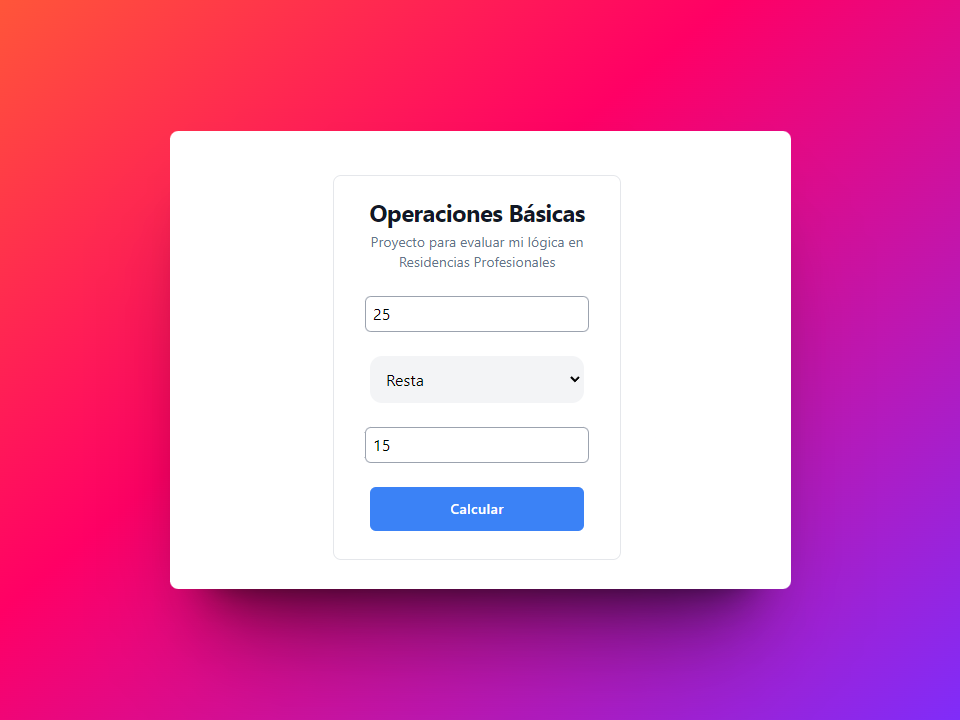
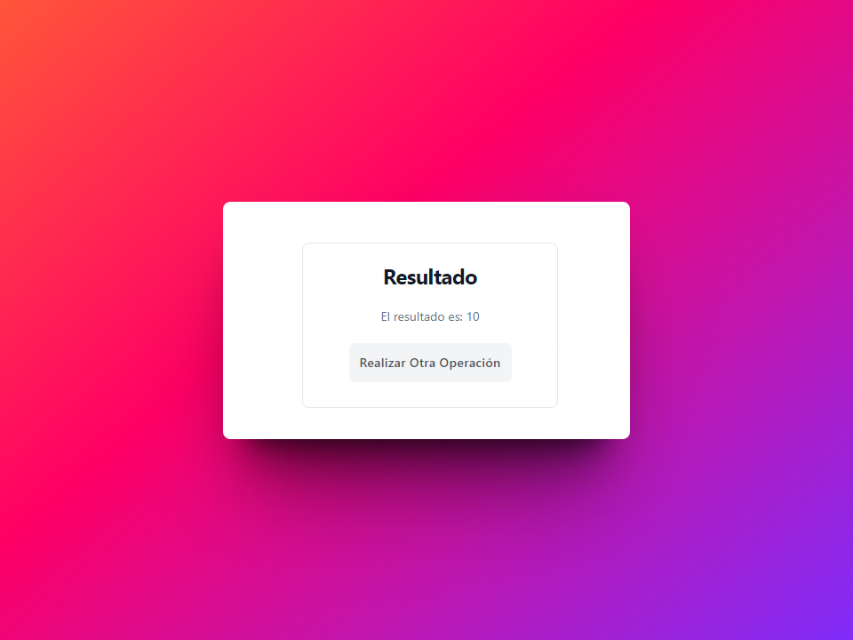

# OPERACIONES BÁSICAS
> 👨‍💻 **Proyecto para residencias o estadias profesionales** Este proyecto fue realizado con el fin de dar a conocer mi lógiica, mi conocimineto con el lenguaje PHP y mi habilidad de trabajar con MVC y BD.!

> 👨‍💻 **Nota:** Al ejecutar el proyecto se creará una BD automaticamente para que las operaciones se registren en ella!

## Diseño del Form

## Ejemplo

### Ejemplo
